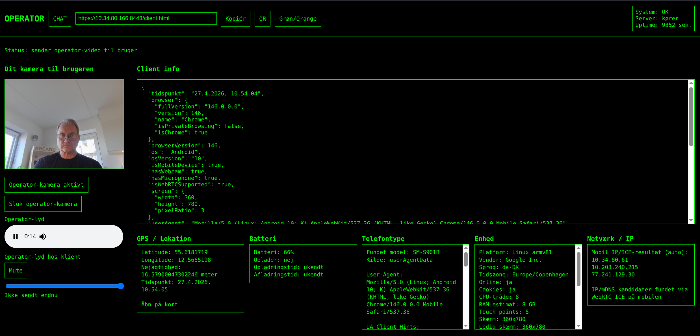
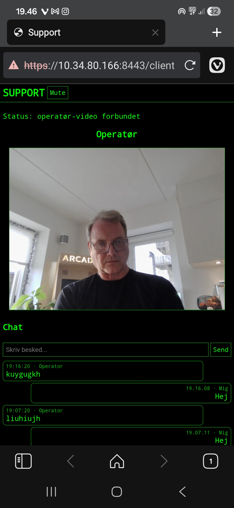

# WebRTC Edge Communication

WebRTC Edge Communication er en browserbaseret support- og kommunikationsprototype, der bruger **WebRTC** og **PeerJS** til realtime kommunikation mellem en operatør og en klient.

Projektet demonstrerer en praktisk løsning til lav-latency kommunikation, hvor en operatør kan oprette forbindelse til en klient via browseren, dele lyd/video, udveksle beskeder og bruge et QR-baseret klientlink til hurtig opkobling.

> Projektet indeholder ikke AI. Fokus er realtime kommunikation, browserbaseret interaktion, PeerJS/WebRTC og praktisk prototypeudvikling.

## Screenshots

### Operator Interface



Operator-view med realtime video, klientstatus, GPS/device-information og kommunikationskontrol.

---

### Client Interface



Browserbaseret klientinterface med kamera/mikrofon, QR-flow og realtime kommunikation via WebRTC.

---

## Formål

Formålet med projektet er at demonstrere en enkel og anvendelig kommunikationsløsning baseret på åbne webteknologier.

Løsningen kan bruges som teknisk prototype for:

- Browserbaseret fjernsupport
- Realtime kommunikation mellem operator og klient
- Peer-to-peer kommunikation via WebRTC
- Hurtig klientopkobling via QR-kode
- Test af kamera, mikrofon, chat og forbindelsesstatus
- Edge-/lokalnet-scenarier hvor installation af klientsoftware ønskes undgået

---

## Centrale teknologier

- **WebRTC** – realtime lyd, video og dataforbindelser i browseren
- **PeerJS** – abstraktionslag oven på WebRTC, som forenkler peer-forbindelser
- **Node.js** – server-runtime
- **Express** – webserver og statisk filservering
- **PeerJS Server** – signaling og peer discovery
- **HTML/CSS/JavaScript** – operator- og klientgrænseflade
- **Docker** – containeriseret afvikling

---

## Funktioner

- Operator-interface i browseren
- Klient-interface i browseren
- WebRTC-forbindelse via PeerJS
- Kamera- og lydstreaming
- Chatfunktion
- QR-kode til klientlink
- Systemstatus-endpoint
- IP-/enhedsoplysninger
- Docker-understøttelse
- HTTPS-understøttelse med lokale udviklingscertifikater

---

## Arkitektur

Løsningen består af tre hoveddele:

### 1. Operator

Operatoren åbner `operator.html` og fungerer som support-/kontrolsiden.

Operatoren kan blandt andet:

- Starte eget kamera
- Generere klientlink
- Vise QR-kode
- Modtage klientforbindelse
- Kommunikere via lyd/video/chat
- Se tekniske statusoplysninger

### 2. Klient

Klienten åbner `client.html`, typisk via et link eller en QR-kode.

Klienten kan blandt andet:

- Starte supportsession
- Dele kamera/mikrofon efter browser-tilladelse
- Kommunikere med operatoren
- Sende status- og enhedsoplysninger

### 3. Server

Serveren håndterer:

- Statisk hosting af operator- og klientfiler
- PeerJS signaling
- Systemstatus via API
- HTTP/HTTPS-afvikling

Når WebRTC-forbindelsen er etableret, foregår selve kommunikationens mediestrømme direkte mellem peers, afhængigt af netværksforhold og WebRTC ICE/STUN/TURN-mekanismer.

---

## Repository-struktur

```text
webrtc-edge-communication/
│
├── public/
│   ├── client.html
│   ├── operator.html
│   └── style.css
│
├── server/
│   └── server.js
│
├── docs/
│   ├── architecture-overview.png
│   └── WebRTC-Support-System-v1.0.pdf
│
├── scripts/
│   └── generate-dev-cert.sh
│
├── cert/
│   └── .gitkeep
│
│
├── Dockerfile
├── package.json
├── .gitignore
├── SECURITY.md
├── LICENSE
└── README.md
```

---

## Installation

### Forudsætninger

- Node.js 18 eller nyere
- npm
- En moderne browser med WebRTC-understøttelse

### Installer dependencies

```bash
npm install
```

### Start serveren

```bash
npm start
```

Hvis der ikke findes lokale certifikater, starter løsningen på HTTP:

```text
http://localhost:8080/operator.html
http://localhost:8080/client.html
```

---

## HTTPS og kamera/mikrofon

Browsere kræver normalt HTTPS for kamera- og mikrofonadgang fra andre enheder end `localhost`.

Til lokal test kan du generere et selvsigneret udviklingscertifikat:

```bash
./scripts/generate-dev-cert.sh
npm start
```

Derefter kan løsningen åbnes på:

```text
https://localhost:8443/operator.html
https://localhost:8443/client.html
```

Certifikater i `cert/` er ignoreret af git og må ikke commit’es.

---

## Docker

Byg image:

```bash
docker build -t webrtc-edge-communication .
```

Kør container:

```bash
docker run --rm -p 8080:8080 -p 8443:8443 webrtc-edge-communication
```

Hvis du vil bruge HTTPS i Docker, kan du mounte lokale certifikater ind i containeren:

```bash
docker run --rm \
  -p 8080:8080 \
  -p 8443:8443 \
  -v "$PWD/cert:/app/cert:ro" \
  webrtc-edge-communication
```

---

## API endpoints

### Systemstatus

```text
GET /api/status
```

Returnerer blandt andet service-status, uptime og om HTTPS-certifikater er fundet.

### Klientinfo

```text
GET /api/whoami
```

Returnerer oplysninger om klientens IP-adresse, forwarded headers og user agent.

---

## Sikkerhedsovervejelser

Dette projekt er en prototype og bør ikke eksponeres direkte på internettet uden yderligere sikkerhed.

Før produktionslignende brug bør der tilføjes:

- Autentificering
- Autorisation
- Rate limiting
- Inputvalidering
- Logging og audit
- TURN-server med adgangskontrol
- TLS-certifikater fra betroet CA
- Hardening af signaling-server

Se også [SECURITY.md](SECURITY.md).

---

## Kendte begrænsninger

- Løsningen er en prototype og ikke en færdig produktionsplatform
- QR-kode genereres via lokal QR-kodegenerator uden CDN-afhængighed
- PeerJS-klientbiblioteket indlæses via CDN i browseren
- Der er ikke implementeret brugerlogin eller adgangsstyring
- TURN-server er ikke konfigureret som standard
- WebRTC-forbindelser afhænger af netværk, NAT og browserunderstøttelse

---

## Mulige forbedringer

- Login/adgangskontrol
- TURN-server-konfiguration
- Bedre session management
- Separat JavaScript i moduler frem for inline scripts
- Testsetup
- CI/CD pipeline
- Docker Compose
- Bedre mobilvisning
- Arkitekturdiagrammer i Markdown/Mermaid

---

## Portfolio-relevans

Projektet viser praktisk erfaring med:

- WebRTC
- PeerJS
- Realtime kommunikation
- Browserbaserede tekniske løsninger
- Node.js og Express
- Docker
- Netværks- og kommunikationsforståelse
- Teknisk prototypeudvikling
- Sikkerhedsbevidst klargøring til open source

---

## Licens

MIT License.

---

## Forfatter

Lars Lindemann Jørgensen

Ingeniør med erfaring inden for kritisk kommunikation, netværksinfrastruktur, systemintegration, automatisering og distribuerede kommunikationssystemer.
